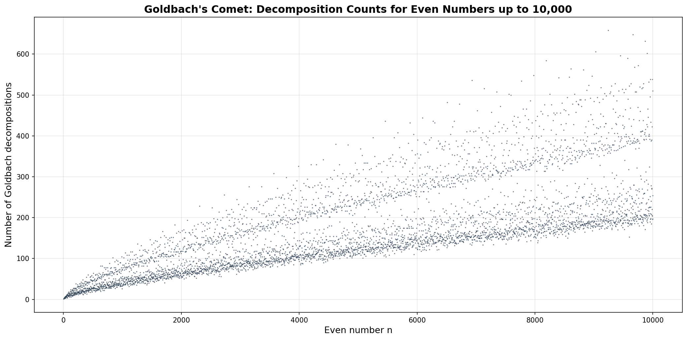
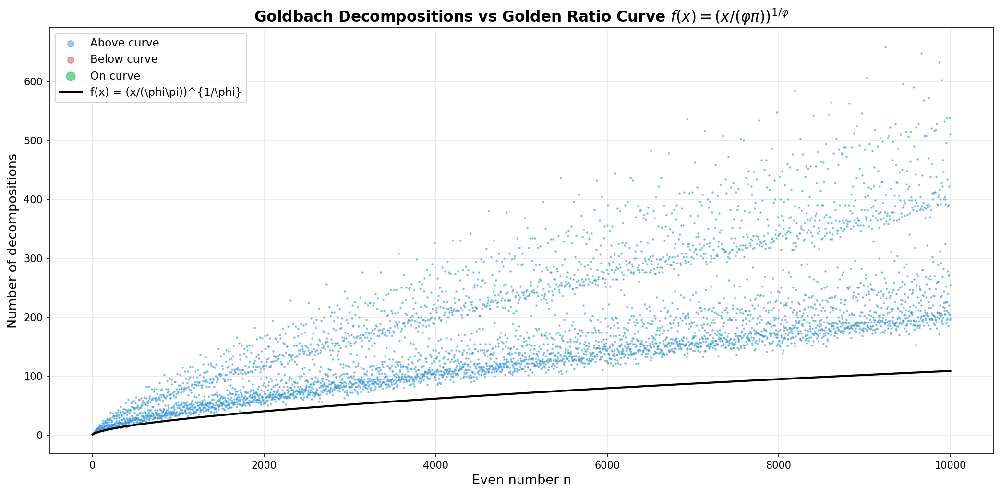
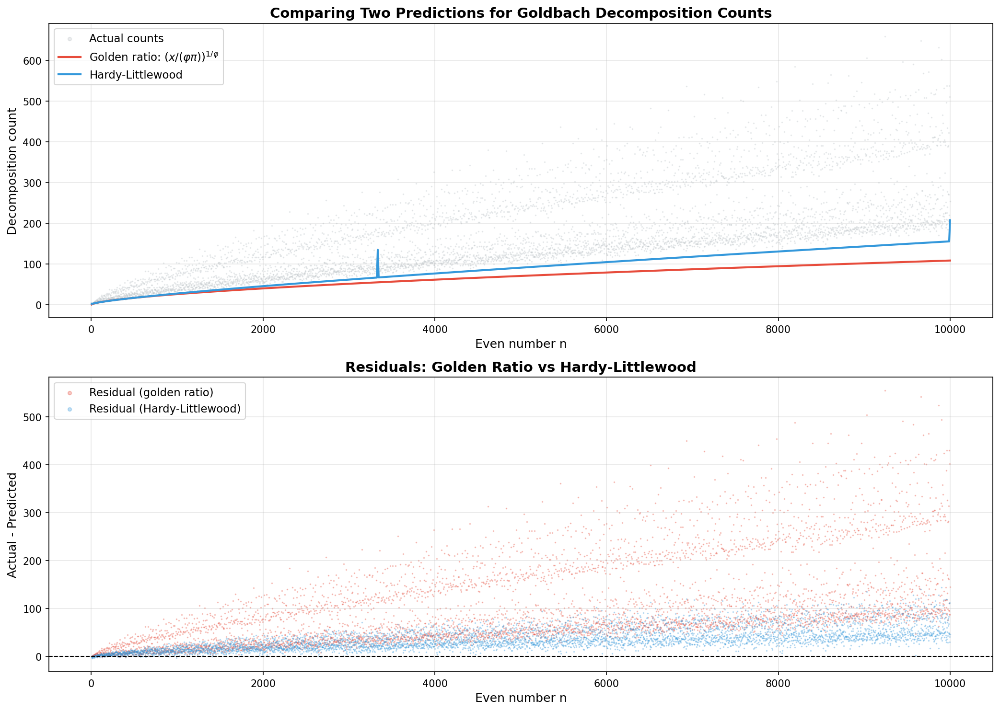
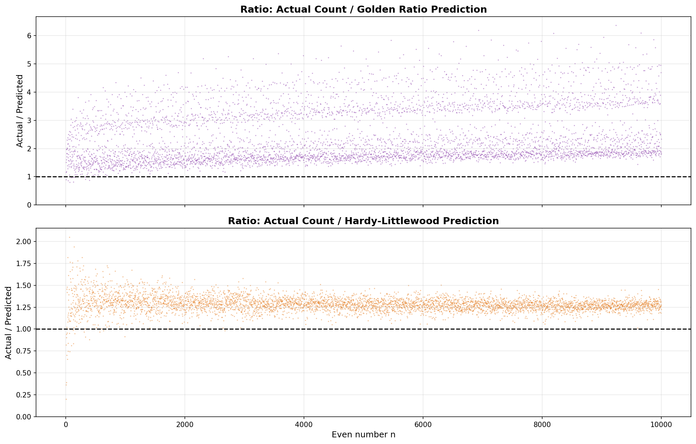
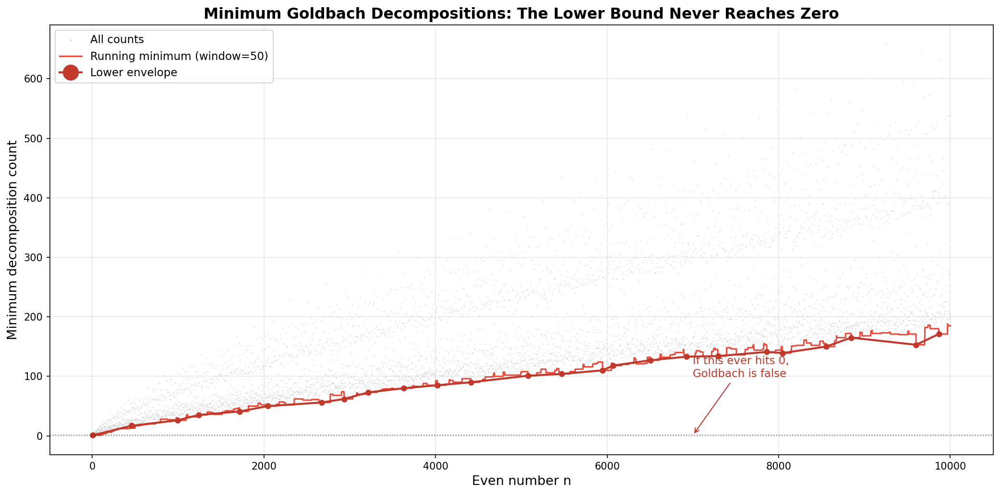
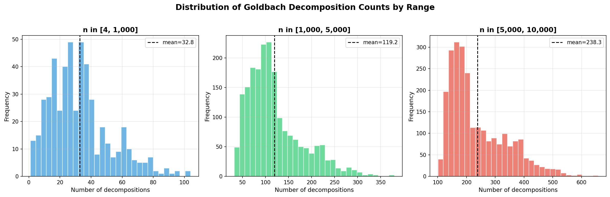

# Statistical Goldbach

Goldbach's Conjecture from a statistical point of view.

Goldbach's conjecture states that every even integer greater than 2 can be expressed as the sum of two prime numbers. While this remains unproven, this project takes a statistical approach: for each even number, count *how many* ways it can be decomposed as a sum of two primes, and look for patterns in those counts.

> **Counting convention:** This counts ordered pairs, so 12 = 5 + 7 and 12 = 7 + 5 are two decompositions. However, 6 = 3 + 3 is counted only once.

## Goldbach's Comet

The scatter plot of decomposition counts produces the famous "Goldbach's comet" -- a striking pattern with multiple arms corresponding to even numbers with different small prime factors.



## Golden Ratio Curve Fit

The original SageMath code fits a curve involving the golden ratio:

**f(x) = (x / (phi * pi))^(1/phi)**

where phi = (1 + sqrt(5)) / 2 is the golden ratio. Points are colored by their position relative to this curve: blue = above, red = below, green = on the curve.



Interestingly, this curve serves as a *lower bound* -- nearly all decomposition counts lie above it, which is consistent with Goldbach's conjecture holding (the count never reaching zero).

## Comparing Predictions

How does the golden ratio formula compare to the classical Hardy-Littlewood prediction? The Hardy-Littlewood conjecture gives an asymptotic estimate based on the prime counting function and a product over prime divisors.



The residual plot (bottom panel) shows Hardy-Littlewood tracks the *center* of the comet better, while the golden ratio curve tracks the *lower edge*.

## Ratio Analysis

Dividing actual counts by each prediction reveals their behavior:



- **Golden ratio** (top): Ratios range from ~1 to 6, showing it's a loose lower bound
- **Hardy-Littlewood** (bottom): Ratios cluster tightly around ~1.3, showing much better tracking of the average

## The Lower Bound Never Reaches Zero

This is the key observation supporting Goldbach's conjecture -- the minimum number of decompositions grows steadily and shows no tendency to approach zero.



## Distribution of Decomposition Counts

The distribution shifts rightward and broadens as even numbers get larger, consistent with the number of decompositions growing roughly as n / (ln n)^2.



## Usage

The original code is written for [SageMath](https://www.sagemath.org/):

```python
# In a Sage notebook or terminal
load("statistical_goldbach")
plot_number_of_decompositions(2, 1000, (x/(a*pi))^(1/a))
```

Parameters:
- `lower_limit`: Start of the even number range
- `upper_limit`: End of the range
- `function_of_x`: Comparison curve (default uses golden ratio)

## Files

| File | Description |
|------|-------------|
| `statistical_goldbach` | SageMath source code |
| `goldbach_comet.png` | Scatter plot of all decomposition counts |
| `goldbach_curve_fit.png` | Color-coded comparison with golden ratio curve |
| `goldbach_comparison.png` | Golden ratio vs Hardy-Littlewood predictions |
| `goldbach_ratio.png` | Ratio of actual to predicted counts |
| `goldbach_minimum.png` | Lower bound growth analysis |
| `goldbach_distribution.png` | Histograms by range |

## License

GPL v3 -- see LICENSE file.
